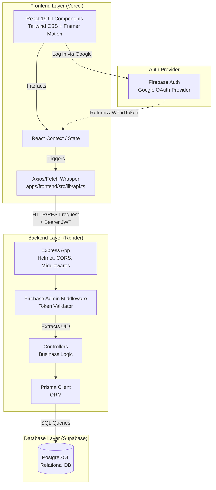
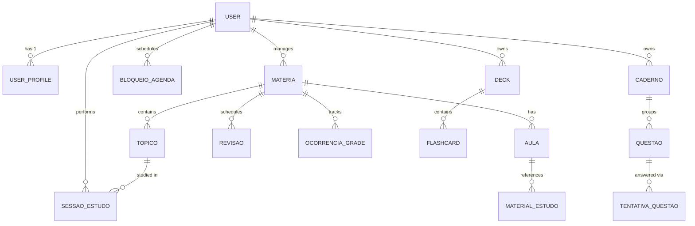
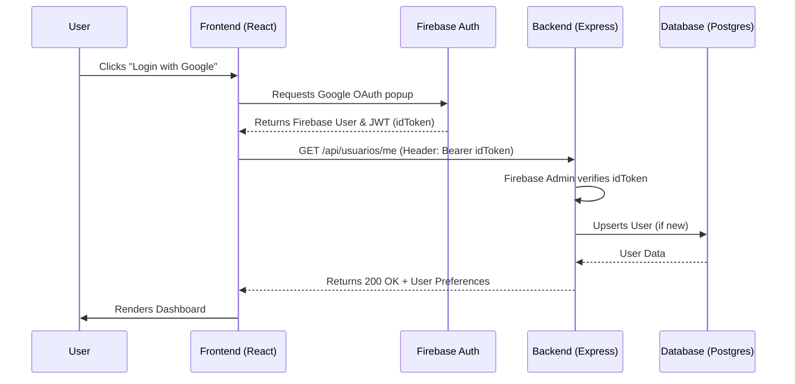

# 🧠 Revisa+ System Architecture

This document provides a high-level technical overview of the Revisa+ ecosystem. Use this as the blueprint for understanding how data flows, how the system is layered, and how the database is structured.

## 🏗️ High-Level System Architecture

The project is a standard Full-Stack Monorepo setup.



---

## 🗄️ Core Database Entity Relationship (ERD)

The system uses PostgreSQL, managed via Prisma (`apps/backend/prisma/schema.prisma`). Below is a simplified ER diagram of the core domains (Study, Scheduling, and Flashcards).



### Domain Highlights:
1. **Academic Tracking:** `Materia` (Subject) is the root entity for `Topico` (Topic), `Aula` (Class), and `FaltaMateria` (Absences).
2. **Active Recall:** `Deck` and `Flashcard` implement SuperMemo SM-2 algorithms for Spaced Repetition (interval, ease factor, reps).
3. **Smart Scheduling:** Uses `GradeFaculdade` (Fixed weekly schedule), `BloqueioAgenda` (User unavailable times), and `Revisao` (Spaced repetition tasks) to dynamically find free study slots.

---

## 🔄 The Authentication Flow

Because we moved from Firebase Client-Side to a Custom Backend, authentication is hybrid:



## 🔴 Real-Time (WebSocket)

The backend exposes a WebSocket endpoint at `/ws` on the same HTTP server (Render supports WS on Web Services).

```mermaid
sequenceDiagram
    participant F as Frontend
    participant B as Backend /ws
    participant G as Google Webhook

    F->>B: GET /api/auth/ws-token (session cookie)
    B-->>F: short-lived JWT (5 min)
    F->>B: WebSocket connect ?token=...
    B-->>F: connected

    G->>B: POST /api/webhooks/google-calendar
    B->>B: syncSingleCalendar + DB update
    B-->>F: calendar.updated

    Note over F: Calendario reloads events;<br/>notifications hook refetches on notification.*
```

**Event types (extend `apps/backend/src/ws/types.ts`):**

| Event | When emitted | Frontend subscriber |
|-------|----------------|---------------------|
| `calendar.updated` | GCal webhook, sync, CRUD evento | `Calendario.tsx` |
| `notification.created` | New notification in DB | `useNotifications` |
| `notification.updated` | Notification status change (future) | `useNotifications` |

Publish from anywhere via `emitCalendarUpdated`, `emitNotificationCreated` in `apps/backend/src/ws/emit.ts`.

Optional env: `VITE_WS_URL` (defaults to `VITE_API_URL` host with `wss:` + `/ws`).

## 🚀 Deployment Pipeline

- **Frontend:** Pushes to `main` auto-deploy to Vercel. SPA routing is handled by `vercel.json` rewriting to `/index.html`.
- **Backend:** Pushes to `main` auto-deploy to Render. The build command automatically runs `npx prisma generate` and `npx prisma migrate deploy` to keep the Supabase DB schema in sync before starting the Node server.
- **Environment Variables:** Must be explicitly declared in both Vercel (`VITE_*`) and Render (`DATABASE_URL`, `JWT_SECRET`, Google OAuth keys, etc).