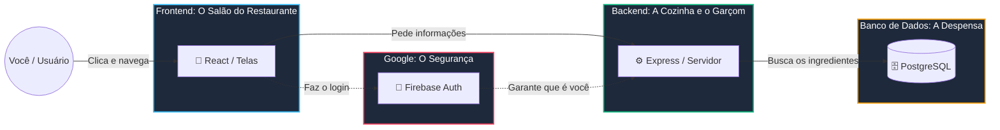

# 🌟 Guia da Lívia: O Manual do seu Ecossistema

Oi, Lívia! Parabéns por ter chegado até aqui. Construir um aplicativo complexo do zero usando Inteligência Artificial é um feito gigante. Você não apenas teve a ideia, como orquestrou a construção de um sistema **Full-Stack** (que tem frente, meio e fundo).

Para que você continue expandindo o Revisa+ com confiança, este guia traduz como a "mágica" funciona por baixo dos panos. 

---

## 🗺️ O Mapa do Revisa+

Imagine o Revisa+ como um grande restaurante de luxo. Ele é dividido em três áreas principais:

### 1. 🎨 O Salão (Frontend - Pasta `apps/frontend`)
É o que você vê: botões, gráficos, cores. Ele é construído com **React**. Ele não sabe guardar nada para sempre; a única função dele é desenhar telas bonitas e pedir coisas para a cozinha. 

### 2. ⚙️ A Cozinha (Backend - Pasta `apps/backend`)
É o cérebro das regras. Construído com **Node.js e Express**. Quando o salão diz *"A Lívia quer criar a matéria de Matemática"*, a cozinha recebe esse pedido, verifica se a Lívia está logada, e anota isso na despensa.

### 3. 🗄️ A Despensa (Banco de Dados)
Onde tudo fica guardado em tabelas rigorosas (como planilhas Excel conectadas umas às outras). Usamos **PostgreSQL**. A cozinha fala com a despensa usando uma ferramenta chamada **Prisma**.

---

## 🤖 A Arte do Prompt: Como pedir coisas novas para a IA?

Como o projeto agora é "profissional" (separado em 3 partes), a IA precisa ser instruída a mexer nas três partes quando você quiser criar algo novo.

Se você pedir apenas: *"Crie uma tela de Metas"*, a IA pode fazer uma tela linda que não salva nada.

### O Prompt de Ouro (Copie e cole quando for criar funcionalidades):

> *"IA, vou te pedir uma nova funcionalidade para o Revisa+. Antes de começarmos, por favor, leia o arquivo `docs/AI_AGENT_CONTEXT.md` e o `docs/ARCHITECTURE.md` para entender a nossa estrutura Full-Stack e nosso banco de dados. 
> 
> Eu quero criar o recurso [NOME DO RECURSO].
> 
> Passo 1: Atualize o `apps/backend/prisma/schema.prisma` com as tabelas necessárias.
> Passo 2: Crie as Rotas e os Controllers no backend (Node.js/Express) para o CRUD (Criar, Ler, Atualizar, Deletar).
> Passo 3: Crie a integração no Frontend (`lib/api.ts`) e construa as telas em React usando Tailwind CSS.
>
> Trabalhe um passo por vez e me avise quando terminar cada um."*

---

## 🛠️ Dicionário Rápido para não se perder

*   **Vercel:** Onde a "Cara" (Frontend) do seu app mora na internet. Atualiza sozinho quando você manda código para o GitHub.
*   **Render:** Onde o "Cérebro" (Backend) do seu app trabalha.
*   **Supabase:** O dono da "Despensa" (Banco de Dados).
*   **Prisma:** O tradutor. Ele lê o arquivo `schema.prisma` e entende exatamente quais são as colunas e tabelas do seu banco, ajudando a IA a não errar o nome das coisas.
*   **Migration:** Toda vez que a IA criar uma tabela nova no Prisma, ela dirá "Precisamos rodar uma migration". Migration é simplesmente enviar a nova planta do banco de dados para o Supabase.

Você está no controle total de uma arquitetura super moderna. Continue sonhando com os próximos recursos, a IA constrói o código, e agora você sabe exatamente para onde cada código vai! 🚀