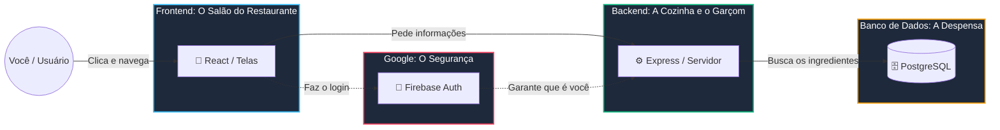

# 🌟 Guia da Lívia: Entendendo o Revisa+

Oi, Lívia! Primeiro, parabéns! Construir a primeira versão de um sistema completo como o Revisa+ usando IA é um feito incrível. Você deu a visão, a inteligência e o direcionamento para o projeto nascer.

Agora que o projeto cresceu e evoluiu, ele ganhou uma estrutura mais profissional e robusta. Este guia foi feito **especialmente para você** entender exatamente como o seu sistema funciona hoje por debaixo dos panos. Assim, você pode continuar usando IAs (como o Google AI Studio, Gemini, etc.) para adicionar novas funcionalidades, sem ficar perdida com a parte técnica.

---

## 🏗️ Como o Revisa+ é dividido hoje? (A Arquitetura)

Antes, o seu aplicativo conversava direto com o Firebase (banco de dados do Google). Isso era ótimo para começar, mas limitava algumas coisas complexas (como deletar tudo de um usuário de uma vez só ou proteger segredos).

Hoje, o Revisa+ foi dividido em **3 grandes partes**, formando o que chamamos de uma aplicação **Full-Stack**.

Para ficar mais fácil de visualizar, pense no Revisa+ como um grande restaurante de luxo:



### 1. 🎨 O Frontend (A "Cara" do App)
É a interface onde o usuário clica, navega e interage (o "Salão"). 
*   **O que usamos:** React, TypeScript, Tailwind CSS.
*   **Onde fica:** Na pasta `apps/frontend/`.
*   **Papel dele:** Ele não salva mais nada diretamente. O papel dele é desenhar telas bonitas e pedir informações para o *Backend*.

### 2. 🧠 O Backend (O "Cérebro" ou Servidor)
É o "Cozinha/Garçom" do sistema. Fica no meio do caminho entre a tela do usuário e o banco de dados.
*   **O que usamos:** Node.js, Express, Prisma.
*   **Onde fica:** Na pasta `apps/backend/`.
*   **Papel dele:** Quando o Frontend diz "Ei, preciso das matérias", o Backend escuta, verifica se a pessoa está logada, pede as matérias ao Banco de Dados, e depois entrega mastigadinho para o Frontend. Ele também garante a segurança e guarda segredos (como senhas e integrações do Google).

### 3. 🗄️ O Banco de Dados (A "Memória")
É a "Despensa" onde tudo fica guardado de forma organizada, em tabelas (linhas e colunas, como no Excel).
*   **O que usamos:** PostgreSQL (hospedado no Supabase).
*   **Como o Backend fala com ele:** Usamos uma ferramenta mágica chamada **Prisma**. O Prisma lê um arquivo (`schema.prisma`) e cria o banco automaticamente, facilitando muito na hora de buscar ou salvar dados.

---

## 🔄 O Fluxo: Como as partes conversam?

Imagine que um usuário entra no Revisa+ e quer criar uma nova matéria.

1.  **Frontend:** O usuário clica em "Salvar Matéria". O React (no Frontend) envia um "pacote de dados" pela internet (chamamos isso de **Requisição HTTP/REST**) para o Backend.
2.  **Backend (Express):** Recebe o pacote na "porta" certa (chamamos isso de **Rota** ou **Endpoint**). Exemplo: `POST /api/materias`. O Backend confere se os dados fazem sentido.
3.  **Backend (Prisma):** O Backend vira para o Prisma e diz: "Prisma, crie uma matéria nova para o usuário X no banco de dados".
4.  **Banco de Dados:** Guarda a matéria.
5.  **Backend:** Avisa o Frontend: "Tudo certo! Matéria criada."
6.  **Frontend:** Mostra a matéria na tela e exibe uma notificação verde de sucesso.

---

## 📁 Entendendo as Pastas do Projeto

Seu projeto agora é um **Monorepo**. Isso significa que no mesmo lugar (repositório) temos códigos separados que trabalham juntos.

```text
Revisa+/
├── apps/
│   ├── frontend/         <-- Tudo que o usuário vê (React, Vite, CSS, Telas)
│   │   └── src/          
│   │       ├── components/  (Pedaços visuais menores, ex: botões)
│   │       ├── pages/       (Telas inteiras, ex: Dashboard.tsx)
│   │       └── lib/api.ts   (Onde o Frontend pede coisas pro Backend)
│   │
│   └── backend/          <-- O servidor (Node.js, Express, Regras de negócio)
│       ├── prisma/
│       │   └── schema.prisma <-- Arquivo SUPER IMPORTANTE. Define todas as tabelas do Banco.
│       └── src/
│           ├── controllers/  <-- Os "gerentes" que processam a lógica (ex: materia.controller.ts)
│           └── routes/       <-- As "portas de entrada" da API (ex: materia.routes.ts)
│
├── docs/                 <-- Guias como este aqui, e a arquitetura oficial do app!
├── package.json          <-- Gerencia as bibliotecas gerais do projeto
└── README.md             <-- A apresentação do seu projeto
```

---

## 🤖 A Arte do Prompt: Como pedir coisas novas para a IA a partir de agora?

Como você não é programadora sênior (ainda!), a IA vai continuar sendo a sua melhor amiga. Mas como o projeto cresceu, a IA precisa ser instruída a mexer nas partes certas quando você quiser criar algo novo.

**O Prompt de Ouro (Copie e cole quando for criar funcionalidades):**

> *"IA, vou te pedir uma nova funcionalidade para o Revisa+. Antes de começarmos, por favor, leia OBRIGATORIAMENTE o arquivo `docs/AI_AGENT_CONTEXT.md` e o `docs/ARCHITECTURE.md` para entender a nossa estrutura Full-Stack e nosso banco de dados.* 
> 
> *Eu quero criar o recurso [NOME DO RECURSO, ex: 'Favoritar Matéria'].*
> 
> *Passo 1: Atualize o `apps/backend/prisma/schema.prisma` com as tabelas ou campos necessários.*
> *Passo 2: Crie as Rotas e os Controllers no backend (Node.js/Express) para o CRUD (Criar, Ler, Atualizar, Deletar).*
> *Passo 3: Atualize o Frontend (`lib/api.ts` e as Telas em React) para chamar essas rotas.*
>
> *Trabalhe um passo por vez e me avise quando terminar cada um."*

### Outras dicas importantes:
*   **Nunca esqueça do Prisma**: Se você quiser criar uma funcionalidade que exija guardar algo novo (ex: "Metas de Estudo Anuais"), lembre-se de dizer para a IA gerar uma nova *migration* no banco de dados.
*   **Autenticação**: O Firebase ainda cuida do login (tela do Google), mas a comunicação com o Backend usa algo chamado "JWT Bearer Token". A IA já sabe disso pelo arquivo de contexto, mas é bom você saber que a segurança está reforçada.

Você tem em mãos uma arquitetura digna de aplicativos grandes do mercado. Boa sorte nas próximas aventuras com o código, e continue criando!
